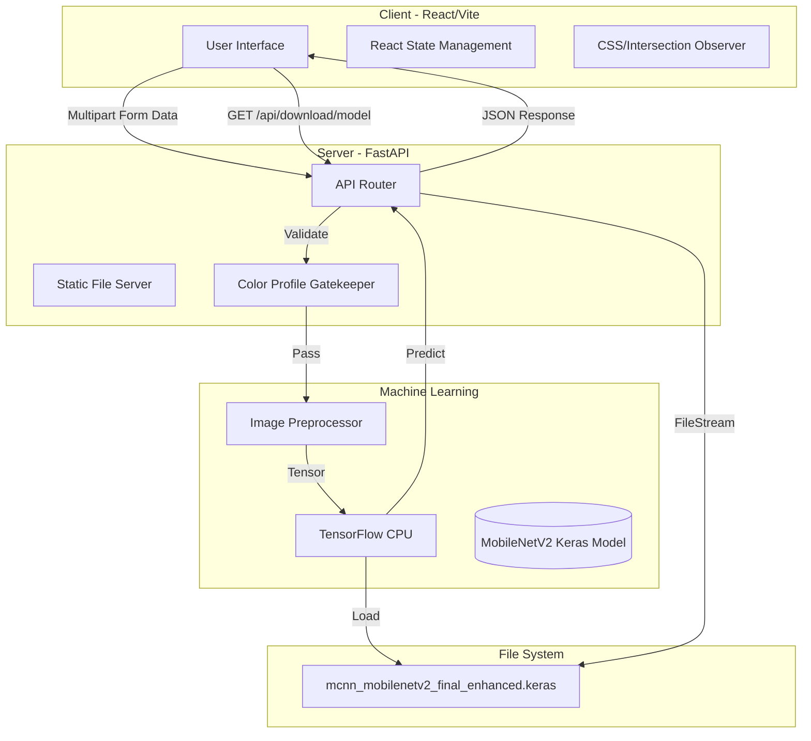
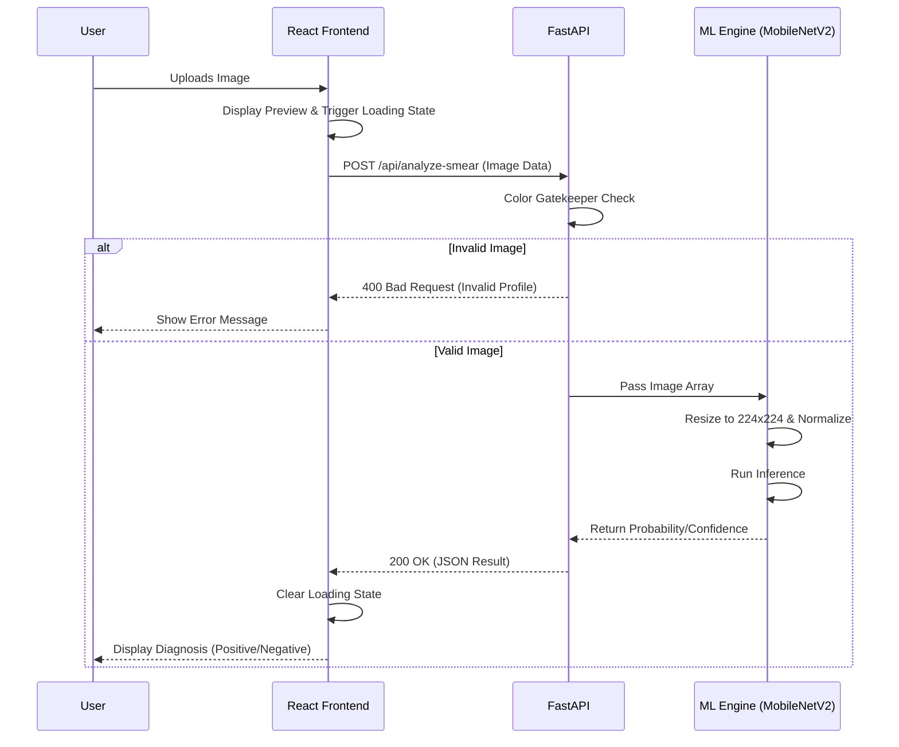

# MCNN System Architecture & Update Report

This document outlines the complete, updated architecture of the Microscan (MCNN) system, including the recent UI/UX overhauls, backend optimizations, and deployment constraints. You can use this content to update your final year project report.

## 1. High-Level System Architecture

The system follows a modern decoupled architecture, combining a lightweight client-side SPA (Single Page Application) with a Python-based RESTful backend tailored for machine learning inference. 

## 2. Component Breakdown

### 2.1 Frontend (React + Vite + TailwindCSS)
- **Framework**: Built with React and bundled via Vite for rapid Hot Module Replacement (HMR) and highly optimized production builds.
- **Design Language**: Implements an "Apple-inspired" aesthetic utilizing minimalist typography, deep contrast (glassmorphism, subtle borders), and high-performance CSS animations.
- **Animation Strategy**: To prevent React rendering lifecycles from conflicting with CSS animations, DOM elements are wrapped in static container `div`s. An `IntersectionObserver` handles class-toggling (`is-visible`) when elements enter the viewport.
- **State Management**: Uses React hooks (`useState`, `useEffect`, `useRef`) to manage view routing (Landing, Scanner, Downloads) without a heavy router library, keeping the bundle size minimal.

### 2.2 Backend (FastAPI)
- **Framework**: FastAPI provides asynchronous request handling and automatic OpenAPI documentation generation.
- **Static Serving**: Acts as the primary web server for the production environment, serving the built Vite assets from the `/dist` directory while routing `/api/*` requests to the ML endpoints.
- **Endpoints**:
  - `POST /api/analyze-smear`: Accepts image uploads, validates color profiles, and returns a JSON diagnosis.
  - `GET /api/download/model`: Directly streams the 19.3MB `.keras` file to the client using `FileResponse`.

### 2.3 Machine Learning Pipeline (TensorFlow)
- **Model Architecture**: Utilizes an optimized MobileNetV2 backbone. Chosen specifically for its low parameter count and high feature-extraction efficiency, making it ideal for deployment on constrained hardware environments.
- **Image Preprocessing Pipeline (Computer Vision)**: Before an image reaches the neural network, it undergoes a strict pre-processing sequence in `backend/preprocess.py` to maximize the model's accuracy:
  1. **Color Profile Gatekeeper**: The backend first checks if the image's color histograms roughly match a Giemsa-stained blood smear. If the user uploads a random image (like a dog or a car), the API immediately rejects it with a 400 Bad Request, saving server compute time.
  2. **CLAHE (Contrast Limited Adaptive Histogram Equalization)**: The image is converted from RGB to the LAB color space. CLAHE is applied exclusively to the **L-channel (Lightness)**. This significantly enhances the contrast of the cellular structures (like identifying the edges of parasites inside red blood cells) without artificially altering the true colors in the A and B channels.
  3. **Median Filtering**: A median blur (kernel size 3) is passed over the contrast-enhanced image. This acts as a denoising step, stripping away microscopic artifacts, dust on the lens, or minor sensor noise that could confuse the model.
  4. **Dimensionality & Formatting**: Finally, the image is resized to `224x224` pixels (the expected input shape for MobileNetV2) and cast to a 32-bit float array with a batch dimension `(1, 224, 224, 3)`. Note: Explicit pixel normalization (dividing by 255) is skipped here because the `.keras` model was trained with an internal `Rescaling` layer that handles normalization automatically.

## 3. Model Training Process (Transfer Learning)

To achieve high accuracy on constrained hardware, the system utilizes a Transfer Learning pipeline rather than training a CNN from scratch. 

### 3.1 Dataset Preparation
The model was trained using the publicly available **NIH Malaria Dataset** (containing 27,558 cell images with equal instances of parasitized and uninfected cells). 
- **Data Augmentation**: To prevent overfitting and simulate variations in clinical microscopy, the training images underwent random rotations, horizontal/vertical flips, and zoom enhancements during the data loading phase.

### 3.2 MobileNetV2 Architecture & Fine-Tuning
- **Base Model Loading**: The `MobileNetV2` architecture was loaded with pre-trained ImageNet weights. The top classification layers were excluded (`include_top=False`).
- **Feature Extraction (Phase 1)**: The base model was frozen. A custom classification head was appended:
  - `GlobalAveragePooling2D` layer to flatten the features.
  - A `Dropout` layer (rate: 0.3) to prevent overfitting.
  - A dense output layer with a `sigmoid` activation function for binary classification (Positive vs Negative).
  The model was trained for 10 epochs using the Adam optimizer to establish baseline weights in the custom head.
- **Fine-Tuning (Phase 2)**: The top 20 layers of the MobileNetV2 base model were unfrozen. The learning rate was drastically reduced (e.g., `1e-5`), and the model was trained for an additional 15 epochs to allow the neural network to adapt its feature extractors specifically to microscopic cell structures.

### 3.3 Callbacks & Export
During training, the following Keras callbacks were used:
- **EarlyStopping**: Monitored validation loss with a patience of 5 epochs to stop training once the model stopped improving.
- **ReduceLROnPlateau**: Reduced the learning rate by a factor of 0.2 if the validation loss plateaued.
The final trained weights were exported as `mcnn_mobilenetv2_final_enhanced.keras`.

## 4. Application Flow

The following sequence diagram illustrates the step-by-step data flow when a user uploads a smear image.

## 5. Deployment Constraints & Solutions
The application is deployed on Render's free tier, which imposes strict hardware limitations:
- **OOM (Out of Memory) Mitigation**: The free tier limits RAM to 512MB. Loading standard TensorFlow typically exceeds this limit, resulting in `Error 137`.
- **Solution**: The backend strictly uses `tensorflow-cpu` via `requirements.txt`. Additionally, threading is artificially limited within the Python environment to prevent memory spikes during concurrent inferences.

## 6. Recent System Updates
The following changes were implemented to refine the system for final release:
1. **Animation Decoupling**: Fixed bugs where cards disappeared upon interaction by isolating visibility animations from React's state management via wrapper DOM nodes.
2. **Copywriting Overhaul**: Stripped out highly technical jargon from the landing page in favor of clean, direct product copy (e.g., "Smart blood smear analysis. Right in your pocket.").
3. **Model Download API**: Introduced a new endpoint to allow developers to download the trained `.keras` weights directly, avoiding frontend asset bloat.
4. **Responsive Layouts**: Fixed mobile layout bugs, aligning the hero buttons ("Start Scanner" and "See how it works") to stack perfectly on small viewports while maintaining horizontal flow on desktops.
5. **UI Tactility**: Added micro-interactions (`active:scale-95`) across all clickable elements for a snappy, responsive feel, and sped up the entry animations for a lighter user experience.
